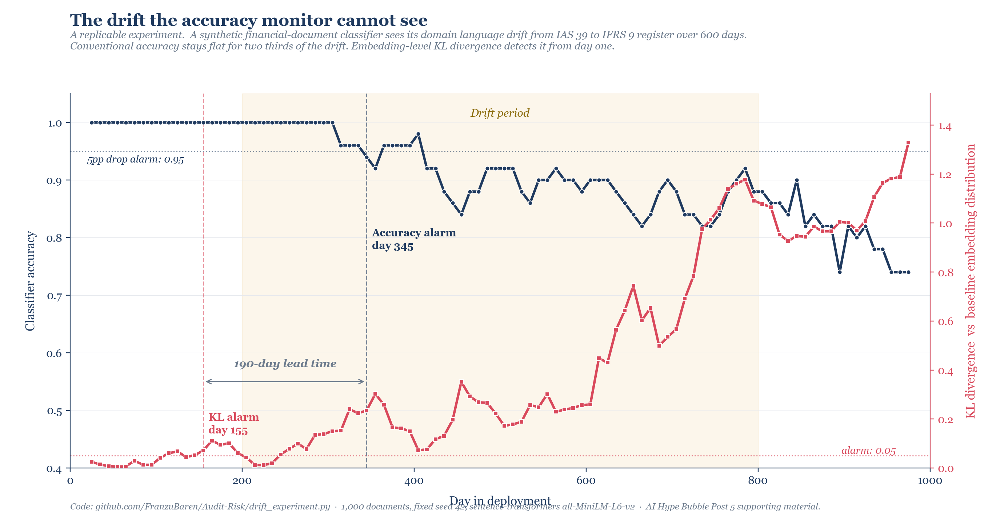

# The Drift That Accuracy Cannot See

A replicable experiment on continuous AI governance, accompanying [The Map Has a Sixth Continent](https://kunskap.substack.com/) (AI Hype Bubble, Post 5 of 6) on the [Kunskap](https://kunskap.substack.com/) Substack.

## What this is

A self-contained experiment that demonstrates a specific failure mode of conventional AI monitoring: when a deployed classifier sees its domain language drift slowly over time, accuracy stays flat for months while embedding-level KL divergence detects the drift from day one.

The result is reproducible with a fixed random seed. On the default configuration the KL divergence monitor provides a **190-day early warning** against the accuracy monitor.



## Why this matters

Conventional model risk management frameworks (ISA procedures, SOX controls, traditional MRM) assume that running the same input twice gives the same output twice. Large language models do not. Embeddings drift across releases. Domain language drifts across regulatory cycles. The mathematics required to monitor this is not new (Fisher-Rao geometry since 1945, Shannon entropy since 1948, Bayesian online changepoint detection since 2007) but is rarely assembled into deployable continuous monitoring stacks.

This experiment is the smallest possible demonstration that the gap matters. It uses a synthetic but realistic scenario: a credit-risk document classifier whose domain language drifts from the conservative-reserve register of IAS 39 to the expected-credit-loss register of IFRS 9. This is a real transition that audited financial reporting went through between 2014 and 2020.

## Reproduce in three commands

```bash
git clone https://github.com/FranzuBaren/Audit-Risk.git
cd Audit-Risk/drift-experiment
pip install -r requirements.txt
python src/drift_experiment.py
```

Expected runtime: roughly three minutes on a CPU. The first run downloads the sentence-transformer model (around 90 MB). Subsequent runs are faster.

Output: console summary plus `figures/fig4_drift_experiment.png` regenerated from your local run.

## Robustness across seeds

The default seed (42) gives a lead time of 190 days. To confirm the result is not seed-specific, run the sensitivity sweep:

```bash
python src/sensitivity.py
```

This re-runs the experiment across 21 random seeds, 6 drift-window widths, and 6 KL alarm thresholds. On a typical run the median KL early-warning lead time across seeds is about 130 days, with the interquartile range covering roughly 100 to 180 days. The lead time stays positive in every seed tested. Across drift speeds, the lead time scales with the drift window width but never inverts.

The takeaway: the post's headline claim ("a 190-day lead time on the reference run") is honest, but the more robust framing is that the KL monitor systematically detects drift months before the accuracy monitor does, across reasonable parameterizations. The exact lead time depends on the configuration.

## Expected output

```
Loading sentence encoder…
Generating corpus…
Encoding…
  embeddings shape: (1000, 384)

Baseline training set: 100 docs
Training accuracy on baseline window: 1.000

Rolling windows: 96

Baseline accuracy: 1.000
Accuracy detection day (5pp drop): 345
KL detection day (KL > 0.05):       155
KL early-warning lead time: 190 days

Figure 4 saved.
```

## How the experiment works

1. **Corpus generation.** One thousand short financial documents are generated from two parallel template registers. Each document is labelled either "high credit risk" or "low credit risk" based on its semantic content, not its register.

2. **Concept drift injection.** Days 0 to 199 sample from the conservative-reserve register only. Days 200 to 799 sample with a linearly increasing probability of using the ECL register. Days 800 to 999 use the ECL register exclusively. The labels remain valid throughout. Only the linguistic surface moves.

3. **Baseline classifier.** A logistic regression classifier is trained on sentence embeddings from the first 100 days (conservative-reserve register only).

4. **Parallel monitoring.** Over the remaining 900 days, a rolling window of 50 documents is evaluated every 10 days. Two signals are computed:
   - **Accuracy** of the baseline classifier on the window (the conventional monitor)
   - **KL divergence** of the window's embedding distribution against the baseline embedding distribution, computed on a 1-D PCA projection with Gaussian KDE (the information-theoretic monitor)

5. **Detection comparison.** Each signal is checked against an alarm threshold. The KL alarm fires first by a wide margin.

## What this is not

This is not a benchmark. It is not a generic drift detection library. It is a single experiment designed to make one specific point about the gap between conventional and information-theoretic monitoring.

For production systems, the same mathematical principles scale to continuous monitoring stacks, but the engineering required to deploy them robustly across enterprise workflows is the actual work, and it is outside the scope of this experiment.

## Files

```
drift-experiment/
├── README.md                    this file
├── requirements.txt             pinned dependencies
├── LICENSE                      MIT
├── src/
│   ├── drift_experiment.py      the main experiment
│   └── sensitivity.py           sweep across seeds, drift speeds, thresholds
├── figures/
│   └── fig4_drift_experiment.png  reference output
└── notebooks/
    └── walkthrough.ipynb        annotated step-by-step exploration
```

## Citation

If you use this in your work, please cite the underlying Substack post:

> Orsi, F. (2026). *The Map Has a Sixth Continent: Survival Archetypes and the Governance Category in the AI Economy.* Kunskap, AI Hype Bubble series, post 5 of 6.

## License

MIT. See [LICENSE](LICENSE).

## Author

Francesco Orsi, PhD. Audit & Risk Data Science Manager. The opinions and analysis in this repository are personal and do not represent the views of any employer or affiliated institution.

Substack: [kunskap.substack.com](https://kunskap.substack.com)
