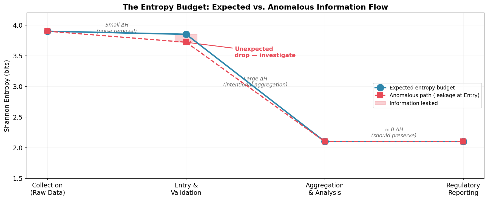
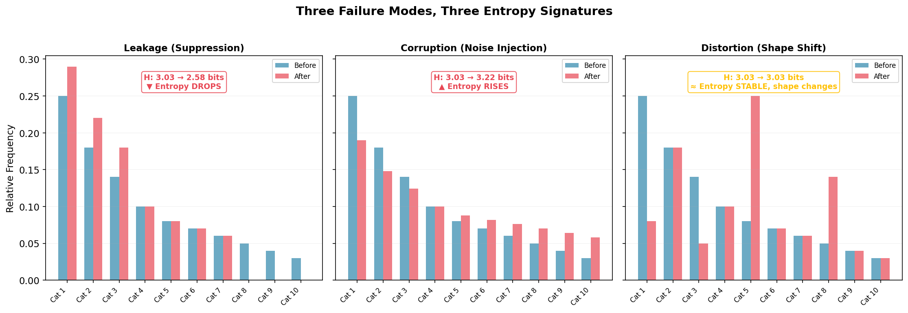
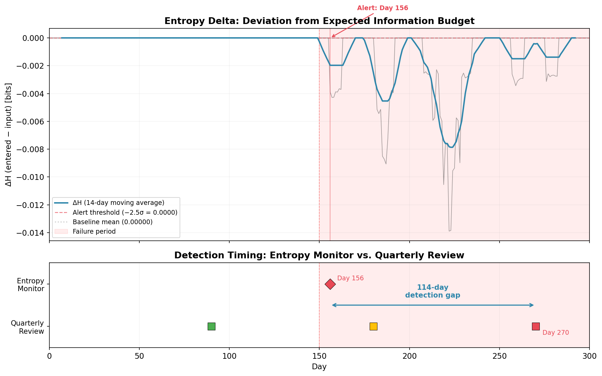
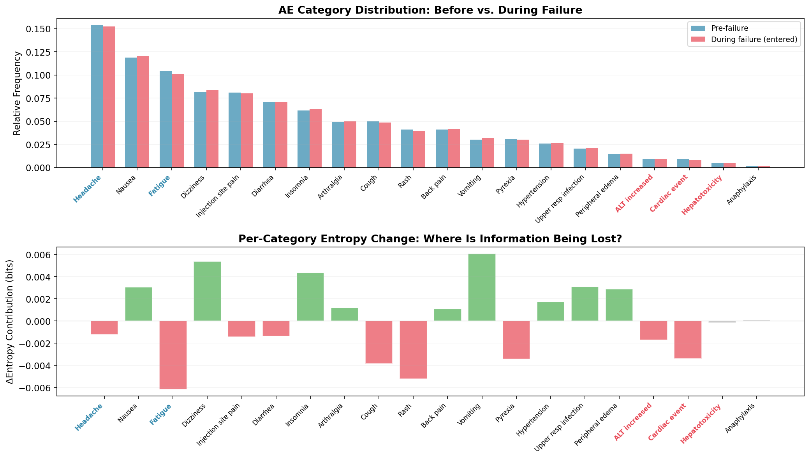
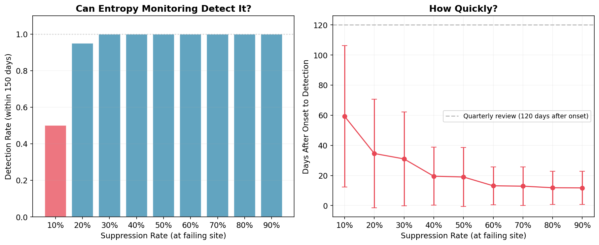
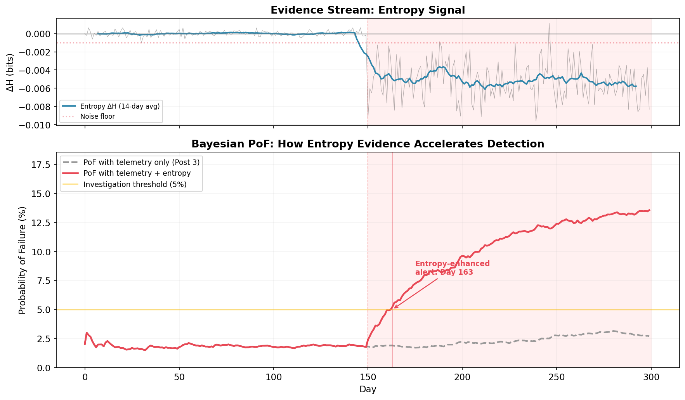

# Entropy Monitoring for Audit: Measuring What Processes Leak

**Companion repository to Post 4 of the *Audit 2.0 in the Age of Non-Deterministic Systems* series on [Kunskap](https://kunskap.substack.com).**

> When an auditor says "we found a data integrity issue," everyone nods. When they say "the adverse event coding process is losing 0.45 bits of Shannon entropy per day at the data entry stage, consistent with a suppression pattern," the room goes quiet. The first is a label. The second is a measurement.

## The Argument

Every business process has an **entropy budget** — a predictable, measurable relationship between input information content and output information content at each transformation stage. When the observed entropy deviates from this budget, something in the process is leaking, injecting, or distorting information — and the pattern of deviation tells you what kind of failure to look for.

This repository provides:

1. A simulation demonstrating entropy monitoring in a clinical trial data pipeline
2. Evidence that continuous entropy monitoring detects systematic failures **114 days** earlier than quarterly reviews
3. A sensitivity analysis showing where the method works and where it breaks
4. Integration with the Bayesian Probability of Failure (PoF) framework from [Post 3](https://kunskap.substack.com/p/stochastic-governance-from-checklists)

## Series Context

| Post | Title | Core Idea | Link |
|------|-------|-----------|------|
| 1 | Audit as Error Correction Code | Audit is the enterprise's counter-entropic sensory apparatus | [Read](https://kunskap.substack.com/p/auditing-or-ensuring-smooth-trips) |
| 2 | The Geometry of Risk | Risk lives on a manifold; topology provides early-warning signals | [Read](https://kunskap.substack.com/p/the-geometry-of-risk-mapping-the) |
| 3 | Stochastic Governance | Bayesian PoF replaces static RAG dashboards | [Read](https://kunskap.substack.com/p/stochastic-governance-from-checklists) |
| **4** | **Entropy: Measuring What Your Processes Leak** | **Shannon entropy as a computable measure of process failure** | **This repo** |

## Repository Structure

```
entropy-audit-post4/
├── README.md                          # This file
├── requirements.txt                   # Python dependencies
├── LICENSE                            # MIT License
├── .gitignore
├── notebooks/
│   └── entropy_simulation.ipynb       # Main simulation (generates 5 figures)
├── scripts/
│   ├── generate_pof_figure.py         # PoF integration figure (6th figure)
│   └── generate_all_figures.py        # Convenience: run everything, output to figures/
├── post/
│   └── post4_entropy.md               # Final blog post with image placement markers
└── figures/                           # Generated figures (included for reference)
    ├── entropy_budget.png             # Fig 1: The entropy budget concept
    ├── entropy_three_signatures.png   # Fig 2: Leakage / Corruption / Distortion
    ├── entropy_main.png               # Fig 3: Detection gap (114 days)
    ├── entropy_decomposition.png      # Fig 4: Per-category entropy change
    ├── entropy_sensitivity.png        # Fig 5: Detection rate vs. suppression rate
    └── entropy_pof_integration.png    # Fig 6: PoF with and without entropy evidence
```

## Figures

### Fig 1: The Entropy Budget


Each pipeline stage has an expected entropy cost. The gap between expected and observed is the signal.

### Fig 2: Three Failure Modes


Leakage (entropy drops), Corruption (entropy rises), Distortion (entropy stable, shape changes).

### Fig 3: Detection Gap


Entropy monitoring alerts on Day 156 — six days after failure onset. Quarterly review catches it on Day 270. Gap: 114 days.

### Fig 4: Category Decomposition


Per-category entropy change pinpoints which AE types are affected. Note: some noise from sampling variation is expected and acknowledged.

### Fig 5: Sensitivity Analysis


At 30%+ suppression, detection is 100% reliable. At 10%, it's a coin flip. Honest about limits.

### Fig 6: PoF Integration


The climax: telemetry-only PoF (gray) never crosses the investigation threshold. Add entropy evidence (red), and the Bayesian framework triggers at Day 163.

## Quick Start

### Prerequisites

- Python 3.9+
- Jupyter (optional, for interactive notebook exploration)

### Setup

```bash
git clone https://github.com/yourusername/entropy-audit-post4.git
cd entropy-audit-post4
pip install -r requirements.txt
```

### Generate All Figures

```bash
python scripts/generate_all_figures.py
```

This runs the simulation notebook and the PoF script, outputting all 6 figures to `figures/`.

### Interactive Exploration

```bash
jupyter notebook notebooks/entropy_simulation.ipynb
```

The notebook is self-contained with markdown explanations for each section.

## Simulation Details

### Scenario

- **50 clinical sites**, each generating ~4 AE records/day across 20 categories
- **Day 150**: Site 0 begins miscoding serious AEs (ALT increased, Cardiac event, Hepatotoxicity) as benign categories (Headache, Fatigue) at 70% suppression rate
- **Detection method**: 7-day rolling window Shannon entropy, with alert threshold at −2.5σ from baseline
- **Comparison**: Continuous entropy monitoring vs. quarterly review (Days 90, 180, 270)

### Key Results

| Metric | Value |
|--------|-------|
| Failure onset | Day 150 |
| Entropy monitor alert | Day 156 (6 days after onset) |
| Quarterly review detection | Day 270 (120 days after onset) |
| Detection advantage | 114 days |
| PoF alert (with entropy) | Day 163 (13 days after onset) |
| PoF alert (without entropy) | Never (within 300 days) |

### Sensitivity

| Suppression Rate | Detection Rate | Mean Detection Time |
|:---:|:---:|:---:|
| 10% | 50% | ~60 days |
| 20% | 95% | ~35 days |
| 30%+ | 100% | ~20 days |

### Honest Limitations

- **Requires ground truth access**: The ΔH approach compares input vs. output data. In practice, this means instrumenting both ends of a pipeline — an architectural investment.
- **Per-site tracking is noisy**: With ~4 records/site/day across 20 categories, site-level entropy generates false alarms. The method works best at aggregate level with sufficient data volume.
- **Blind to distribution-preserving failures**: If records are swapped between patients but the overall distribution is unchanged, entropy won't detect it. Record-level reconciliation remains essential.
- **Summary statistic**: Entropy tells you THAT something changed, not WHY. Investigation is human work.
- **Sensitive to data volume**: Needs substantial data flow (hundreds of records/day) for reliable detection. A 30-patient pilot study doesn't generate enough data.

## Intellectual Positioning

This work is not a claim that entropy monitoring replaces existing audit methods. It is a claim that Shannon entropy — applied rigorously to organizational data flows — provides a **distributional layer of visibility** that field-by-field checks fundamentally cannot provide. The auditor who combines quantitative instruments (entropy, topology, Bayesian PoF) with domain knowledge, professional skepticism, and the willingness to have a difficult conversation with a process owner — that's the auditor who sees the crisis forming while others are still formatting last quarter's slide deck.

## Citation

If you use this work in your own research or presentations:

```
Bonato, F. (2026). Entropy: Measuring What Your Processes Leak.
Audit 2.0 in the Age of Non-Deterministic Systems, Post 4.
Kunskap Substack. https://kunskap.substack.com
```

## License

MIT License. See [LICENSE](LICENSE).
